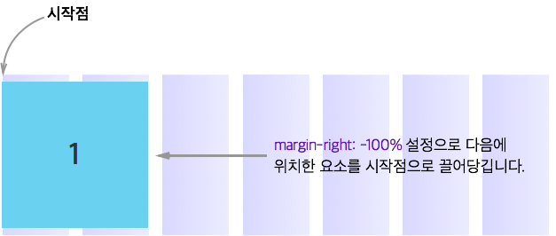
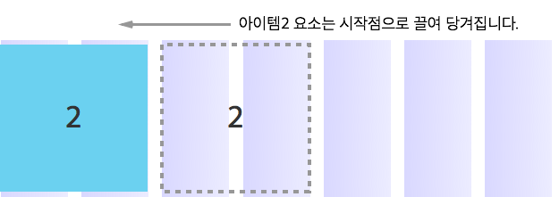

### __Susy2 그리드 레이아웃 활용__

Susy2 그리드 레이아웃 4가지 활용 방법 DEMO

> **고정(Static) 레이아웃**<br>
    데스크탑 디자인만 필요한 경우 활용 방법

> **중첩(Nested) 레이아웃**<br>
    중첩된 복잡한 레이아웃(박스 안의 박스)이 필요한 경우 활용 방법

> **유동(Fluid) 레이아웃**<br>
    Susy2가 지원하는 기본 레이아웃 활용 방법

> **반응형(RWD: Responsive) 레이아웃**<br>
    Susy2가 지원하는 기본 레이아웃 활용 방법

> **적응형(AWD: Adaptive) 레이아웃**<br>
    적응형 레이아웃을 필요로 하는 경우 활용 방법

-

#### 그리드 시스템 유형

[대칭(Symmetrical) VS 비대칭(Asymmetrical)](http://susy.readthedocs.org/en/latest/diy/#core-settings)

```scss
// 일정한 컬럼 간격의 그리드 시스템
$symmetrical: (
  columns: 12, // <Number> 컬럼 총 개수
  gutters: 1/4,
);

// 일정하지 않은 컬럼 간격의 그리드 시스템
$asymmetrical: (
  columns: (1 3 4 6 2), // <List> 비대칭 컬럼 설정
  gutters: .5,
);
```

[대칭(Symmetrical) 그리드 확인](http://susy.readthedocs.org/en/latest/diy/#is-symmetrical)

`is-symmetrical()`

```scss
$sym: is-symmetrical(12);
$asym: is-symmetrical(2 4 6 3);

// 출력 결과
$sym: 12;
$asym: null;

// 조건 확인
$result: if(is-symmetrical(asym), true, false);
```

-

#### Susy2 기본 믹스인 & 함수

**믹스인**
- [[M]](http://susy.readthedocs.org/en/latest/toolkit/#container) `+container(<layout>)` ＞ 컨테이너 레이아웃 컨텍스트 설정
- [[M]](http://susy.readthedocs.org/en/latest/toolkit/#span-mixin) `+span(<span>)` ＞ HTML 요소 레이아웃 설정
- [[M]](http://susy.readthedocs.org/en/latest/toolkit/#nested-context) `+nested(<span>)` ＞ 개별 레이아웃 컨텍스트 설정

**함수**
- [[F]](http://susy.readthedocs.org/en/latest/toolkit/#span-function) `span(<span>)` ＞ width 값 반환
- [[F]](http://susy.readthedocs.org/en/latest/toolkit/#gutters) `gutter(<span>)` ＞ 거터(Gutter) 값 반환

-

#### Susy2 글로벌 설정([Global Settings](http://susydocs.oddbird.net/en/latest/settings/#global-defaults))

```scss
/*
 * Susy2 Globa Settings
 * http://susydocs.oddbird.net/en/latest/settings/#global-defaults
 */
$susy: (
	// Flow
	// 문서의 읽는 방향 설정 (ltr, rtl)
	flow: ltr,

	// Math
	// 유동형(Fluid), 고정형(Static) width 설정 (fluid, static)
	// ※ 고정형으로 설정할 경우, column-width 값도 설정해줘야 함
	math: fluid,

	// Output
	// 레이아웃 출력 모드 설정 (float, isolate)
	// ※ 현재 Susy 버전은 Float을 메인으로 출력하지만, 향후 Flexbox 등 다양한 방법 지원 예정
	output: float,

	// Gutter Position
	// 거터의 방향 설정 (after, before, split, inside, inside-static)
	// ※ inside 설정은 Padding으로 처리됨
	gutter-position: after,

	// Container
	// 컨테이너 요소의 최대 폭 값을 설정 (auto, <length>)
	container: auto,

	// Container Position
	// 상위 요소를 기준으로 하는 컨테이너 요소의 레이아웃 정렬 (center, left, right, <length> * 2)
	container-position: center,

	// Columns
	// 컬럼의 총 개수 설정 (4, <number>, <list>)
	columns: 4,

	// Gutters
	// 거터의 폭 설정 (1/4, <gutter-width>/<column-width>)
	gutters: .25,

	// Column Width
	// 컬럼의 폭 설정 (false, null, <length>)
	column-width: false,

	// Global Box Sizing
	// 전역 CSS3 박스 사이즈 설정 (content-box, border-box)
	global-box-sizing: content-box,

	// Last Flow
	// 레이아웃 내의 마지막 요소 float 방향 설정 (to, from)
	last-flow: to,

	// Debug
	// 레이아웃 디버깅 환경 설정
	debug: (
		// 그리드 이미지: (hide, show, show-columns, show-baseline)
		// ※ 그리드 이미지를 보여줌, 만약 Compass vertical rhythms을 사용할 경우,
		// -line-height 설정 값에 따라 베이스라인을 그려줌.
		image: hide,

		// 그리드 컬럼 색상: (rgba(hsl(240, 100%, 70%), .25), <color>)
		color: rgba(hsl(240, 100%, 70%), .25),

		// 그리드 모드: (background, overlay)
		// ※ overlay 설정일 경우, 컨테이너 요소의 ::before 요소를 사용하여 오버레이 함.
		output: background,

		// 그리드 토글 버튼 방향: (top right, <direction>)
		// ※ overlay 설정에서만 사용 가능.
		toggle: top right
	),

	// Use Custom
	// 사용자 정의 설정
	use-custom: (
		// 사용자 정의 background-image() 믹스인 사용 유무: (true, false)
		// ※ Compass, Bourbon의 믹스인을 사용할 경우, true로 설정
		background-image: true,

		// 사용자 정의 background-size(), -origin(), -clip() 사용 유무 (false, true)
		background-options: false,

		// 사용자 정의 box-sizing() 사용 유무: (true, false)
		// ※ Compass, Bourbon의 믹스인을 사용할 경우, true로 설정
		box-sizing: true,

		// 사용자 정의 clearfix() 사용 유무: (false, true)
		clearfix: false,

		// 사용자 정의 rem() 사용 유무: (true, false)
		rem: true,

		// 사용자 정의 breakpoint() 사용 유무: (true, false)
		breakpoint: true,
	)
);
```

-

###### Susy2 주요 믹스인/함수

```sass
//
 * --------------------------------
 * Susy2 주요 믹스인/함수
 * --------------------------------

 // 믹스인
 +container( auto | <length> )
 +span( <length> | ... )
 +gutters( <length> | ... )

 // 함수
 container( auto | <length> )
 span( <length> | ... )
 gutter( <length> | ... )
```

-

###### Susy2 툴킷(Toolkit)

```sass

// 클리어(Clear)
// --------------------------------------------------------------------
+break()   // clear: both
+nobreak() // clear: none

// 초기화(Reset)
// --------------------------------------------------------------------
+alpah() | +first() // 흐름(Flow)이 rtl 일 경우 사용 권장: margin-left: 0
+omega() | +last()  // 흐름(Flow)이 ltr 일 경우 사용 권장: margin-right: 0

// 마진 공간(space - margin)
// --------------------------------------------------------------------
+push() // 밀어넣기 (margin-left (+))
+pull() // 잡아당기기 (margin-right (-))

// 패딩 공간(space - padding)
// --------------------------------------------------------------------
+prefix() // 그리드 요소 왼쪽에 패딩 공간 삽입 (padding-left)
+suffix() // 그리드 요소 오른쪽에 패딩 공간 삽입 (padding-left)
+pad()    //그리드 요소 양쪽에 패딩 공간 삽입: prefix() + suffix()

// 양쪽 마진 공간(space - margin both)
// --------------------------------------------------------------------
+pre()    // 그리드 요소 앞에 공간 삽입 (margin-left)
+post()   // 그리드 요소 뒤에 공간 삽입 (margin-right)
+squish() // 그리드 요소 양쪽에 공간 삽입: pre() + post()

// 상하좌우 마진/패딩 공간(space - margin/padding both)
// --------------------------------------------------------------------
+bleed() // 그리드 요소 상/우/하/좌에 마진/패딩 공간 동시 삽입 (margin/padding)

// 아이솔레이트 레이아웃
// --------------------------------------------------------------------
+isolate() // 서브픽셀 라운딩 이슈 해결 레이아웃 구현
+gallery() // 갤러리 스타일 레이아웃을 구현

// 상하좌우 마진/패딩 공간(space - margin/padding both)
// --------------------------------------------------------------------
+show-grid() // 디버깅 그리드를 화면에 그림

```

---

#### Float Isolate 테크닉

##### 문제와 해결책
* [Sub Pixel 랜더링 문제(ie하위브라우저)](http://ejohn.org/blog/sub-pixel-problems-in-css/)
* [Sub Pixel 랜더링 해결책](http://thelucid.com/2010/12/03/the-solution-to-fluid-inconsistencies-and-equal-height-columns/)

-

##### 해결책 원리 설명

__isolate 테크닉에 요구되는 사항__<br>
※ 테크닉 사용시 혼란이 올 수 있으니, 음수 마진 값 설정에 대한 이해를 반드시 하셔야 합니다!

* 개별 레이아웃 요소는 `margin-left` 값을 통해 정확한 위치를 설정합니다.
* 개별 레이아웃 요소는 `margin-right: -100%;`를 사용하여 뒤에 오는 요소를 끌어(pull) 당깁니다.

-

###### STEP 1

__3 컬럼 레이아웃__을 디자인한다고 가정합시다.


-

###### STEP 2

아이템1에 `margin-left: 0;`을 설정하여 왼쪽 끝 시작 점에 맞춥니다. 이어서 `margin-right: -100%;` 값을 설정하여 아이템2를 시작점으로 끌어옵니다.





-

###### STEP 3

아이템2 요소에 `margin-left` 속성 값을 퍼센트(%)로 설정하여 3번째 컬럼의 위치( 컬럼x2 + 거터x2 )로 이동시킵니다.


이어서 아이템2 요소에 `margin-right: -100%`를 설정하여 아이템3 요소를 끌어 당깁니다.


그러면 아이템3 요소는 시작점으로 이동하게 됩니다.


-

###### STEP 4

아이템3 요소에 `margin-left` 속성 값을 퍼센트(%)로 설정하여 5번째 컬럼의 위치( 컬럼x4 + 거터x4 )로 이동시킵니다.


※ 이와 같은 패턴으로 각각의 레이아웃 요소에 정확한 레이아웃을 설정하면 Sub Pixel 문제에서 벗어날 수 있습니다. 이와 같은 레이아웃 방법을 Isolate 레이아웃이라고 합니다.

-

###### STEP 5

만약 아이템3 요소를 다음 행(Row)의 시작점에 위치하여 레이아웃을 설정하고자 한다면, 먼저 `clear: left` 속성을 설정하여 Clear 영향권에서 벗어납니다.


그리고 `margin-left: 0`을 설정하여 시작점으로 이동시킵니다. 간단하죠? :-)

